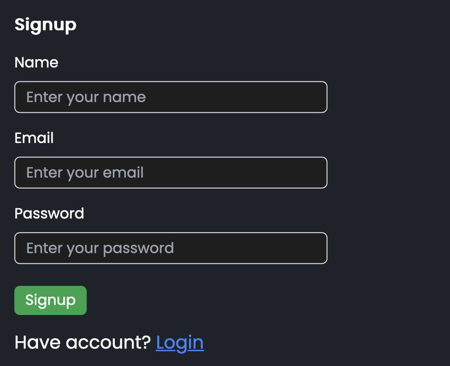

# Stack Store - Online Bookstore App

Stack Store is an online bookstore where users can browse, purchase, and manage books effortlessly. It includes secure user authentication, theme toggling (light/dark mode), and a responsive interface for an enhanced user experience.

  
---

## Features

- **User Authentication**: Secure login and signup for users.
- **Light/Dark Mode**: Switch between light and dark themes for comfortable browsing.
- **Responsive UI**: Works seamlessly across devices.
- **Book Browsing**: Explore books, view details, and manage your cart.

---

## Tech Stack

- **Frontend**: React.js, Next.js, React Context API
- **Backend**: Node.js, Express
- **Database**: MongoDB
- **Styling**: CSS, Tailwind CSS, Daisy UI
- **State Management**: React Context API

---

## Screenshots

- **Signup Page**  

  

- **Login Page** 
 
  
---

## Installation

Follow these steps to run Stack Store locally:

1. **Clone the repository**  
   ```bash
   git clone https://github.com/your-username/stack-store.git
   cd stack-store
   ```

2. **Install dependencies**  
   ```bash
   npm install
   ```

3. **Run the app**  
   ```bash
   npm run dev
   ```

4. **Access the app**  
   Visit `http://localhost:3000` in your browser.

---

## Contributing

Feel free to fork this repository and submit pull requests to improve the app!

---

## License

This project is licensed under the MIT License.
